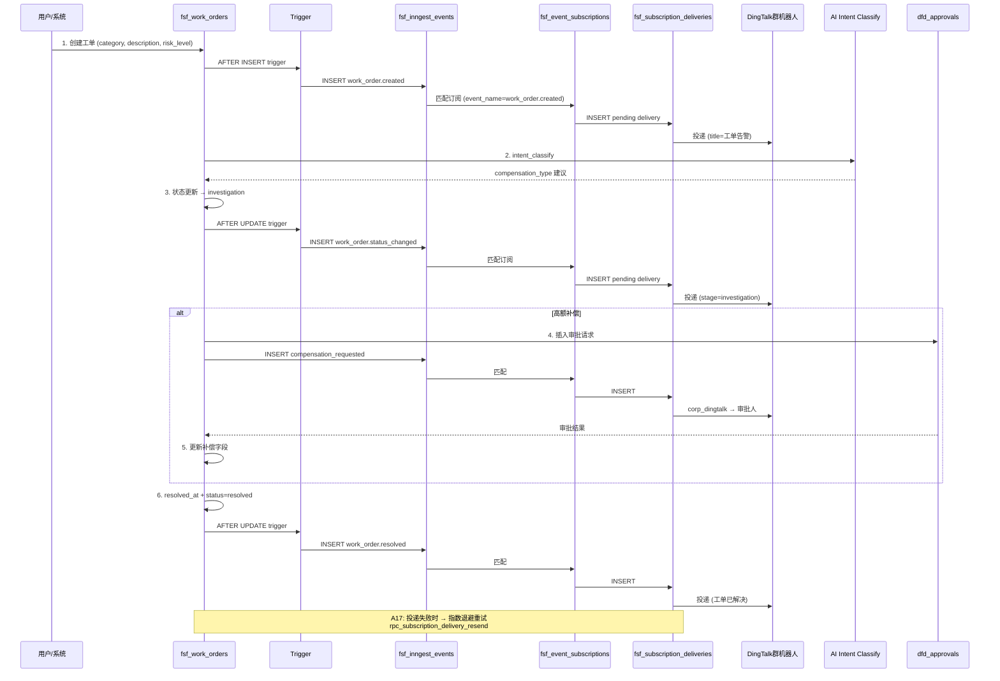

# Audit Events Taxonomy + FSF SOP Flow

> A19.2: `dfd_audit_events` 事件分类文档
> A19.3: Food Safety Flow SOP + 事件流图

---

## Part 1: Audit Events Taxonomy (`dfd_audit_events`)

### Category 维度

| category | 说明 | 典型 action |
|---|---|---|
| `auth` | 认证事件 | login, logout, token_refresh, mfa_challenged |
| `workspace` | 工作区配置 | workspace_seed, workspace_updated, plan_changed |
| `member` | 成员管理 | member_invited, member_joined, member_role_changed, member_removed |
| `datasource` | 数据源 | datasource_connected, datasource_sync, datasource_error |
| `model` | AI 模型 | model_selected, model_invoked, model_error |
| `skill` | Skill 执行 | skill_loaded, skill_executed, skill_error |
| `mcp` | MCP 工具 | mcp_tool_called, mcp_auth |
| `knowledge` | 知识库 | doc_indexed, doc_queried, doc_chunked |
| `session` | Session | session_created, session_archived, session_resumed |
| `run` | Run 执行 | run_started, run_completed, run_failed, run_cancelled |
| `artifact` | 产物 | artifact_created, artifact_viewed, artifact_shared |
| `export` | 导出 | export_requested, export_completed |
| `settings` | 设置 | settings_changed, api_key_rotated, webhook_registered |

### Severity 维度

| severity | 触发条件 | 示例 |
|---|---|---|
| `info` | 正常操作成功 | 工单创建、成员加入、补偿审批通过 |
| `warning` | 可恢复异常 | 投递失败但重试成功、SLA 接近超时 |
| `critical` | 不可恢复故障 | 补偿金额超阈值、SLA 已超时、AI 分类失败 |

### Workspace Config 事件

| action | category | 说明 |
|---|---|---|
| `workspace_seed` | workspace | 工作区初始化配置（配置存在 dfd_audit_events payload 中） |
| `workspace_updated` | workspace | 配置变更 |

### FSF 专用事件（via `fsf_inngest_events`）

| event_name | source | 说明 |
|---|---|---|
| `work_order.created` | admin_create / intent_classify / trigger | 工单创建 |
| `work_order.status_changed` | trigger (AFTER UPDATE) | 状态变更 |
| `intent_classified` | ai_intent_classify | AI 意图分类 |
| `compensation_approved` | human_approval | 补偿审批通过 |
| `compensation_rejected` | human_approval | 补偿审批拒绝 |

---

## Part 2: Food Safety Flow SOP

### Stage 流程图

```
用户/系统
    │
    ▼
┌─────────────────────────────────────────────────────────────┐
│  1. REPORTED — 工单登记                                        │
│     - 触发: admin_create / intent_classify / wo_trigger     │
│     - 字段: category, description, risk_level                │
│     - SLA: high=2h, medium=8h, low=24h                       │
│     - 事件: work_order.created                               │
│     - 投递: 订阅 → DingTalk群机器人                           │
└───────────────────────┬─────────────────────────────────────┘
                        │ (人工介入)
                        ▼
┌─────────────────────────────────────────────────────────────┐
│  2. TRIAGE — 分诊                                            │
│     - 操作: handler 认领工单，设置 handler_id                 │
│     - 检查: 异物类型、变质程度、身体反应证据                   │
│     - AI: intent_classify → category / compensation_type 建议 │
│     - 事件: work_order.status_changed (stage=triage)         │
└───────────────────────┬─────────────────────────────────────┘
                        │
          ┌─────────────┼─────────────┐
          ▼             ▼             ▼
    [异物外部]    [变质/异物内部]  [身体不适/其他]
          │             │             │
          ▼             ▼             ▼
┌─────────────────────────────────────────────────────────────┐
│  3. INVESTIGATION — 调查处理                                  │
│     - 联系门店确认情况                                         │
│     - 收集订单信息、evidence_urls（照片/视频）                 │
│     - AI 评估: compensation_type 建议                          │
│     - 事件: work_order.status_changed (stage=investigation)  │
└───────────────────────┬─────────────────────────────────────┘
                        │
          ┌─────────────┼─────────────┐
          ▼             │             ▼
    [小额补偿]          │      [高额/复杂]
    (refund≤50/        │       (需审批)
     voucher≤100)       │             │
          │             │             ▼
          └─────────────┼──────► PENDING_APPROVAL
                          │        │
                          ▼        ▼
┌─────────────────────────────────────────────────────────────┐
│  4. PENDING_APPROVAL — 等待审批                             │
│     - dfd_approvals 表插入审批记录                            │
│     - 事件: compensation_approved / compensation_rejected     │
│     - 钉钉 corp_dingtalk → 审批人 agent                      │
│     - SLA 计时暂停（escalated_at 设置）                      │
└───────────────────────┬─────────────────────────────────────┘
                        │
          ┌─────────────┴─────────────┐
          ▼                           ▼
    [审批通过]                   [审批拒绝]
          │                           │
          ▼                           ▼
┌─────────────────────────────────────────────────────────────┐
│  5. RESOLUTION — 补偿执行                                    │
│     - 实施补偿: refund / voucher / reissue / monetary        │
│     - 字段: compensation_type, compensation_amount           │
│     - 事件: work_order.status_changed (stage=resolution)    │
│     - 投递: 工单已解决 → DingTalk                            │
└───────────────────────┬─────────────────────────────────────┘
                        ▼
┌─────────────────────────────────────────────────────────────┐
│  6. CLOSED — 归档                                          │
│     - resolved_at 设置                                        │
│     - 事件: work_order.status_changed (stage=closed)         │
│     - 事件: work_order.resolved                             │
└─────────────────────────────────────────────────────────────┘
```

---

## Part 3: FSF Event Flow (时序图)



---

## Part 4: SLA 监控规则

| risk_level | SLA | 超时后果 | 触发条件 |
|---|---|---|---|
| high | 2h | `sla_status = 'breached'`, `escalated_at = now()` | SLA deadline 过期 |
| medium | 8h | `sla_status = 'breached'`, `escalated_at = now()` | SLA deadline 过期 |
| low | 24h | `sla_status = 'breached'`, `escalated_at = now()` | SLA deadline 过期 |

**SLA 预警**（`sla_status = 'warning'`）：剩余时间 < SLA 目标的 20%

**SLA 监控 Job**（A10+）：
```sql
-- 定时更新 sla_status
UPDATE datafoundry.fsf_work_orders
SET sla_status = CASE
  WHEN sla_deadline < now() THEN 'breached'
  WHEN sla_deadline < now() + (sla_target_hours * 0.2 || ' hours')::interval THEN 'warning'
  ELSE 'ok'
END
WHERE status NOT IN ('resolved', 'closed')
  AND sla_status != 'breached';
```

---

## Part 5: Delivery Channel 矩阵

| Channel | 触发事件 | 签名方式 | 重试策略 | 备注 |
|---|---|---|---|---|
| dingtalk | 所有 WO 事件 | HMAC-SHA256 robot secret | A17 backoff | 群机器人 webhook |
| corp_dingtalk | 审批请求 | OAuth2 app | A17 backoff | 内部应用 |
| email | work_order.resolved | 无 | 标准 SMTP retry | |
| webhook | 所有 WO 事件 | Bearer token / HMAC | A17 backoff | |
| sms | high risk created | 无 | 运营商 retry | 备用 |
| slack | 所有 WO 事件 | Slack signing secret | A17 backoff | 备用 |

---

## Part 6: Work Order Field State Machine

```
case_no:      WO-{YYYYMMDD}-{XXXX}       (唯一定位符)
status:       open → investigating → pending_approval → resolved → closed
stage:        reported → triage → investigation → resolution → closed
sla_status:   ok → warning → breached
risk_level:   high | medium | low        (创建时固定)

compensation_type: null → refund → voucher → reissue → monetary
escalated_at:  null → now()              (breach 时设置)
resolved_at:   null → now()               (resolved 时设置)
```

---

## Part 7: 关键 SQL RPC 一览

| RPC | 文件 | 功能 |
|---|---|---|
| `rpc_work_order_create` | 011 | 创建 WO + 事件 |
| `rpc_work_order_update_status` | 010 | 更新 status/stage + trigger |
| `rpc_work_order_list` | 011 | WO 列表 + event_count |
| `rpc_work_order_list_events` | 010 | WO 关联事件 |
| `rpc_subscription_poll_match` | 007 | 订阅匹配 |
| `rpc_subscription_record_delivery` | 007 | 记录投递结果 |
| `rpc_subscription_delivery_resend` | 007 | 重发请求 |
| `rpc_subscription_poll_retries` | 012 | 扫描待重试 |
| `rpc_workspace_config_get` | 012 | 读退避配置 |
| `rpc_workspace_config_set` | 012 | 写退避配置 |
| `rpc_audit_search` | 013 | 审计搜索 |
| `rpc_audit_stats` | 013 | 审计统计 |