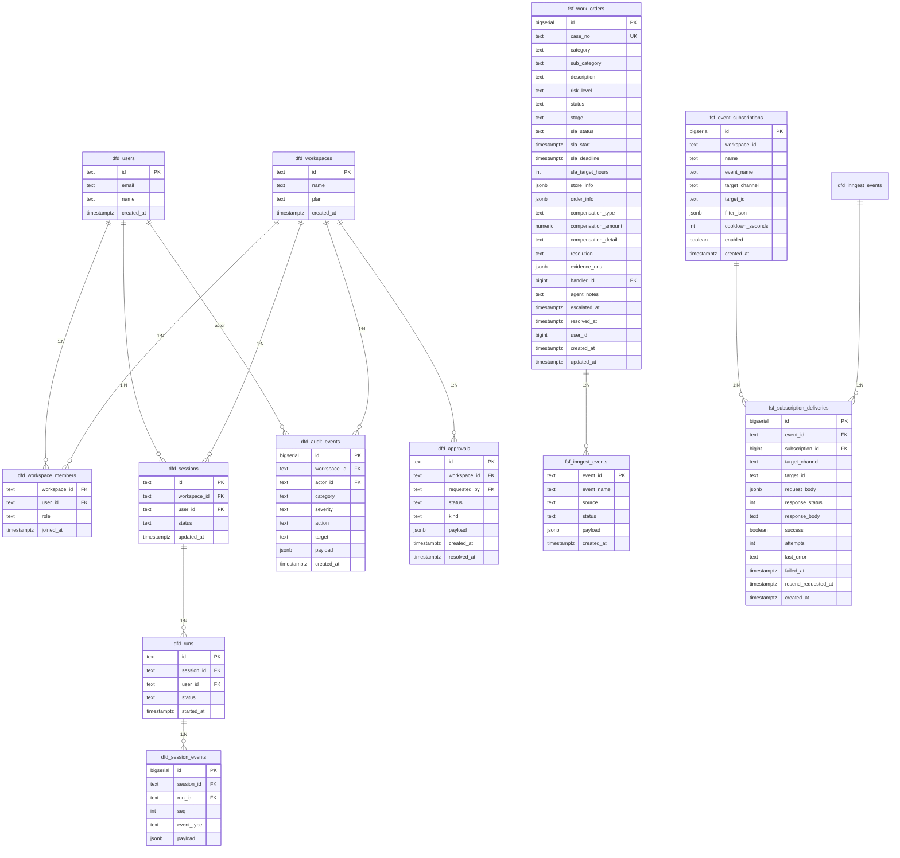

# Schema ERD — datafoundry-enhanced

> 完整数据库关系图。source-of-truth: `docs/supabase-xicha-bridge/*.sql`

---

## Legend

```
┌─────────────────────┐     1:N     ┌─────────────────────┐
│   dfd_workspaces    │◄────────────│  dfd_workspace_members│
│  (id text PK)       │             │  (workspace_id FK)   │
└─────────────────────┘             └─────────────────────┘
         │ 1:N                              │ 1:N
         ▼                                   ▼
┌─────────────────────┐             ┌─────────────────────┐
│    dfd_users        │◄────────────│    dfd_sessions     │
│  (id text PK)      │             │  (user_id FK)        │
└─────────────────────┘             └─────────────────────┘
                                           │
                                           │ 1:N
                                           ▼
                                    ┌─────────────────────┐
                                    │   dfd_runs          │
                                    │ (session_id FK)     │
                                    └─────────────────────┘
                                           │
                                           │ 1:N
                                           ▼
                              ┌─────────────────────────┐
                              │ dfd_session_events     │
                              │ (run_id FK)            │
                              └─────────────────────────┘

┌─────────────────────┐  1:N   ┌─────────────────────────┐
│ dfd_audit_events   │──────►│ dfd_workspace_members   │
│ (workspace_id FK)  │        └─────────────────────────┘
│ (actor_id FK→users)│
└─────────────────────┘        ┌─────────────────────────┐
                                │   dfd_approvals        │
                                │ (workspace_id FK)       │
                                └─────────────────────────┘
```

---

## Core DFD Tables

### `dfd_workspaces`
| Column | Type | Notes |
|---|---|---|
| id | text PK | workspace identifier |
| name | text | display name |
| plan | text | free / pro / enterprise |
| created_at | timestamptz | |

### `dfd_users`
| Column | Type | Notes |
|---|---|---|
| id | text PK | user identifier |
| email | text | |
| name | text | |
| created_at | timestamptz | |

### `dfd_workspace_members`
| Column | Type | Notes |
|---|---|---|
| workspace_id | text FK→dfd_workspaces | |
| user_id | text FK→dfd_users | |
| role | text | admin / member / viewer |
| joined_at | timestamptz | |

**PK**: `(workspace_id, user_id)`

### `dfd_sessions`
| Column | Type | Notes |
|---|---|---|
| id | text PK | |
| workspace_id | text FK→dfd_workspaces | |
| user_id | text FK→dfd_users | |
| status | text | active / archived |
| updated_at | timestamptz | |

### `dfd_runs`
| Column | Type | Notes |
|---|---|---|
| id | text PK | |
| session_id | text FK→dfd_sessions | |
| user_id | text FK→dfd_users | |
| status | text | running / completed / failed |
| started_at | timestamptz | |

### `dfd_session_events`
| Column | Type | Notes |
|---|---|---|
| id | bigserial | |
| session_id | text FK→dfd_sessions | |
| run_id | text FK→dfd_runs | |
| seq | int | ordering within session/run |
| event_type | text | |
| payload | jsonb | |

**PK**: `(session_id, seq)` + unique `id`

---

## Audit & Approvals

### `dfd_audit_events`
| Column | Type | Notes |
|---|---|---|
| id | bigserial PK | |
| workspace_id | text FK→dfd_workspaces | |
| actor_id | text FK→dfd_users | nullable |
| category | text | auth / workspace / member / run / session / settings… |
| severity | text | info / warning / critical |
| action | text | e.g. `workspace_seed`, `member_invited` |
| target | text | target identifier (e.g. work_order case_no) |
| payload | jsonb | arbitrary metadata |
| created_at | timestamptz | |

**Indexes**:
- `(workspace_id, created_at desc)`
- `payload` GIN (jsonb_path_ops)
- `target` text_pattern_ops

**Search RPC**: `rpc_audit_search(keyword, time_range, category, severity, action, actor_id, target_like)`

### `dfd_approvals`
| Column | Type | Notes |
|---|---|---|
| id | text PK | |
| workspace_id | text FK→dfd_workspaces | |
| requested_by | text FK→dfd_users | |
| status | text | pending / approved / rejected |
| kind | text | |
| payload | jsonb | |
| created_at | timestamptz | |
| resolved_at | timestamptz | nullable |

**Index**: `(status, created_at desc)`

---

## FSF — Food Safety Flow

### `fsf_work_orders`
| Column | Type | Notes |
|---|---|---|
| id | bigserial PK | |
| case_no | text UK | `WO-YYYYMMDD-XXXX` |
| category | text | foreign_object_external/internal, spoilage, body_discomfort… |
| sub_category | text | |
| description | text | |
| risk_level | text | high (2h) / medium (8h) / low (24h) |
| status | text | open / investigating / pending_approval / resolved / closed |
| stage | text | reported → triage → investigation → resolution → closed |
| sla_status | text | ok / warning / breached |
| sla_start | timestamptz | |
| sla_deadline | timestamptz | risk_level → hours |
| sla_target_hours | int | |
| store_info | jsonb | `{store_id, store_name}` |
| order_info | jsonb | `{order_no}` |
| compensation_type | text | refund / voucher / reissue / monetary |
| compensation_amount | numeric | |
| compensation_detail | text | |
| resolution | text | |
| evidence_urls | jsonb | array of URLs |
| handler_id | bigint FK→dfd_users | nullable |
| agent_notes | text | |
| escalated_at | timestamptz | |
| resolved_at | timestamptz | |
| user_id | bigint | |
| created_at | timestamptz | |
| updated_at | timestamptz | |

**Indexes**: `case_no`, `(status, created_at desc)`, `(sla_deadline)` (SLA monitor)

### `fsf_inngest_events`
| Column | Type | Notes |
|---|---|---|
| event_id | text PK | UUID |
| event_name | text | work_order.created / work_order.status_changed / intent_classified… |
| source | text | admin_create / ai_intent_classify / compensation_approved… |
| status | text | pending / processed / failed |
| payload | jsonb | `{work_order_id, category, risk_level…}` |
| created_at | timestamptz | |

**Indexes**: `(status, created_at)`, `(payload->>'work_order_id')`

**Trigger**: `AFTER INSERT OR UPDATE ON fsf_work_orders` → auto-insert `work_order.status_changed` event

### `fsf_event_subscriptions`
| Column | Type | Notes |
|---|---|---|
| id | bigserial PK | |
| workspace_id | text | |
| name | text | |
| event_name | text | |
| target_channel | text | dingtalk / corp_dingtalk / email / webhook / sms / slack |
| target_id | text | URL or agent_id |
| filter_json | jsonb | channel-specific filter |
| cooldown_seconds | int | |
| enabled | boolean | |
| created_at | timestamptz | |

**Index**: `(workspace_id, event_name, enabled)`

### `fsf_subscription_deliveries`
| Column | Type | Notes |
|---|---|---|
| id | bigserial PK | |
| event_id | text FK→fsf_inngest_events | |
| subscription_id | bigint FK→fsf_event_subscriptions | |
| target_channel | text | |
| target_id | text | |
| request_body | jsonb | |
| response_status | int | HTTP status |
| response_body | text | truncated 2KB |
| success | boolean | |
| attempts | int | retry count |
| last_error | text | |
| failed_at | timestamptz | |
| resend_requested_at | timestamptz | A17: backoff reschedule |
| created_at | timestamptz | |

**Indexes**: `(status, resend_requested_at)` (retry scan), unique `(event_id, subscription_id)`

---

## Notification Routes (Legacy)

### `fsf_notification_routes`
| Column | Type | Notes |
|---|---|---|
| id | bigserial PK | |
| workspace_id | text | |
| channel | text | |
| config | jsonb | |

### `fsf_notification_deliveries`
| Column | Type | Notes |
|---|---|---|
| id | bigserial PK | |
| route_id | bigint FK→fsf_notification_routes | |
| event_id | text | |
| status | text | sent / failed |
| created_at | timestamptz | |

### `fsf_webhook_inbox`
| Column | Type | Notes |
|---|---|---|
| id | bigserial PK | |
| event_type | text | |
| payload | jsonb | |
| status | text | pending / processed |
| received_at | timestamptz | |

---

## ERD Diagram (Mermaid)



---

## Table Summary

| Schema | Table | Rows (approx) | Primary Key |
|---|---|---|---|
| datafoundry | dfd_workspaces | N | id (text) |
| datafoundry | dfd_users | N | id (text) |
| datafoundry | dfd_workspace_members | N×M | (workspace_id, user_id) |
| datafoundry | dfd_sessions | N×U | id (text) |
| datafoundry | dfd_runs | S×R | id (text) |
| datafoundry | dfd_session_events | R×E | id (bigserial) |
| datafoundry | dfd_audit_events | A | id (bigserial) |
| datafoundry | dfd_approvals | P | id (text) |
| datafoundry | dfd_datasources | D | id (text) |
| datafoundry | dfd_memories | M | id (text) |
| datafoundry | fsf_work_orders | WO | id (bigserial) |
| datafoundry | fsf_inngest_events | IE | event_id (text) |
| datafoundry | fsf_event_subscriptions | SUB | id (bigserial) |
| datafoundry | fsf_subscription_deliveries | DEL | id (bigserial) |
| datafoundry | fsf_notification_routes | NR | id (bigserial) |
| datafoundry | fsf_notification_deliveries | ND | id (bigserial) |
| datafoundry | fsf_webhook_inbox | WI | id (bigserial) |

**总计: 17 张表**（datafoundry schema）